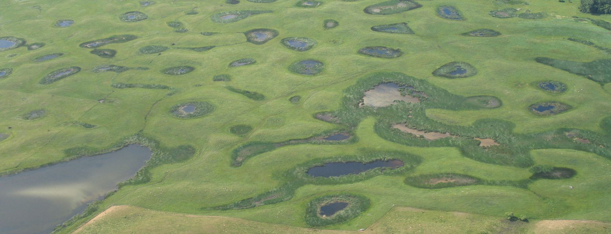

```{ojs}
//| output: false
import { kit, fmt, up10, NAMES, COLORS, PONDS, DRY } from "./js/viz.js"
import { calculator } from "./js/calculator.js"
K = kit({ d3, Plot, htl })
totals = FileAttachment("data/site/totals.json").json()
recent = FileAttachment("data/site/recent_elasticity.json").json()
curves = FileAttachment("data/site/elasticity_curves.json").json()
headline = FileAttachment("data/site/headline.json").json()
geo = FileAttachment("data/site/geo.json").json()
strata = FileAttachment("data/site/strata.json").json()
payload = FileAttachment("data/site/scenario.json").json()
shift = FileAttachment("data/csv/elasticity_shift.csv").csv({ typed: true })
```

```{ojs}
//| output: false
el = Object.fromEntries(recent.map((d) => [d.species, d]))
order = recent.slice().sort((a, b) => b.es_med - a.es_med).map((d) => d.species)
refYears = new Set(headline.ref_years)
early = (d) => d.year <= 1964
recentYear = (d) => refYears.has(d.year)
DAB = ["MALL", "NOPI", "BWTE", "GADW", "NSHO"]
meanOf = (species, f, value) => d3.mean(d3.groups(totals.filter((d) => f(d)), (d) => d.year),
  ([, v]) => value(v.filter((d) => species.includes(d.species))))
birds = (v) => d3.sum(v, (d) => d.prairie_total)
pintailShare = (f) => meanOf(["NOPI"], f, birds) / meanOf(DAB, f, birds)
perPond = (sp, f) => d3.mean(totals.filter((d) => d.species === sp && f(d)), (d) => d.prairie_total / d.prairie_ponds)
shiftOf = (model, sp) => shift.find((d) => d.model === model && d.species === sp)
nopiMain = shiftOf("main", "NOPI")
nopiYear = shiftOf("year_re", "NOPI")
dry = K.driestYears(totals)
```

::: {.column-screen .banner}

<div class="banner-title"><h1>May Ponds and Breeding Ducks in Prairie Canada</h1></div>
:::

::: {.masthead}
<p class="dek">Using 70 years of data from the Waterfowl Breeding Population and Habitat Survey, I examined how closely breeding ducks on the Canadian prairies tracked the number of ponds each spring.</p>

<p class="byline"> · September 2026 · <a href="prairie-ducks-methods.pdf">Full methods (PDF)</a> · <a href="">Code and data</a></p>
:::

Since 1955, the U.S. Fish and Wildlife Service and Canadian Wildlife Service have conducted the Waterfowl Breeding Population and Habitat Survey by air each May. Survey crews fly at low altitude in small aircraft along fixed survey transects, counting ducks and ponds. Ground crews count a sample of the same transects, and these counts are used to correct for birds missed by aerial survey observers.

I used published survey estimates for all 15 strata covering the Canadian prairies (strata 26 to 40 in southern Alberta, Saskatchewan, and Manitoba). I examined the strength of the response of breeding ducks to pond numbers, whether this response differed among species, and whether this response had changed since the 1950s. These answers are relevant to estimating how many breeding ducks are lost when wetlands are drained.

## Ponds and ducks since 1955

The number of May ponds on the Canadian prairies depends mainly on spring rainfall and snowmelt, and can halve or double from one year to the next. Breeding ducks follow the ponds. During the driest springs, indicated by shading in Figure 1, breeding dabbling ducks declined in abundance alongside pond numbers, and abundance increased again during consecutive wet years such as 1994 to 1997. Aerial surveys were not conducted in 2020 and 2021 due to the COVID-19 pandemic.

Species composition also changed, with Northern Pintails, shown in the bottom strip of Figure 1, accounting for ${fmt.pct(pintailShare(early))} of breeding dabbling ducks between 1955 and 1964, compared to ${fmt.pct(pintailShare(recentYear))} in the most recent ten surveys.

::: {.column-body-outset}

```{ojs}
K.figure({
  number: 1,
  title: "May ponds and breeding dabbling ducks in Prairie Canada, 1955–2026",
  legendItems: [
    { label: "May ponds", color: PONDS, key: "line" },
    { label: "Ten driest springs", color: DRY, key: "band" },
    ...["NSHO", "GADW", "BWTE", "MALL", "NOPI"].map((sp) => ({ label: NAMES[sp], color: COLORS[sp] }))
  ],
  body: K.responsive((w) => K.pondsAndDucks({ totals, width: w })),
  note: `Totals across strata 26 to 40. Ducks are stacked by species, with Northern Pintail at the base of the stack. The ten springs with the driest conditions were ${dry.slice(0, -1).join(", ")}, and ${dry.at(-1)}.`,
  table: K.tableView(
    d3.groups(totals, (d) => d.year).map(([year, v]) => ({ year, ponds: v[0].prairie_ponds, ...Object.fromEntries(v.map((d) => [d.species, d.prairie_total])) })),
    [
      { key: "year", label: "Year" },
      { key: "ponds", label: "May ponds", num: true, format: fmt.int },
      ...DAB.map((sp) => ({ key: sp, label: NAMES[sp], num: true, format: fmt.int }))
    ]
  )
})
```

:::

## How strongly each species responds

These totals combine two components, namely the response to wet and dry years and slow changes in land use, harvest, climate, and individual population sizes over decades. To separate these components, I fitted a hierarchical generalized additive model for each species. The model included a smooth long-term trend specific to each survey stratum, allowing pond effects to be estimated from year-to-year deviations relative to that trend. In other words, I examined whether years with more water than usual within a given survey stratum also had more birds than usual.

I express the result as a pond elasticity, defined as the percentage change in breeding birds associated with a 1% change in the number of May ponds. An elasticity of 1 means that bird numbers increase and decrease in proportion to pond numbers. An elasticity of 0.3 means that a 10% increase in pond numbers is associated with about a 3% increase in bird numbers.

Northern Pintail had the highest pond elasticity over the most recent ten surveys (${fmt.dec2(el.NOPI.es_med)}; 95% interval ${fmt.dec2(el.NOPI.es_lo)} to ${fmt.dec2(el.NOPI.es_hi)}), indicating that a 10% increase in pond numbers within a stratum would correspond to an increase of about ${fmt.pct(up10(el.NOPI.es_med))} in the number of pintails breeding there. Mallard had the lowest pond elasticity, ${fmt.dec2(el.MALL.es_med)} (95% interval ${fmt.dec2(el.MALL.es_lo)} to ${fmt.dec2(el.MALL.es_hi)}), or about ${fmt.pct(up10(el.MALL.es_med))} more birds. This is consistent with existing knowledge of these two species, as pintails settle opportunistically, with many individuals flying over the prairies to breed farther north in dry years [@hestbeck1995], while Mallards are more likely to return to previous breeding locations [@johnson1988]. Previous studies in the region have also examined relationships between duck numbers and wetland conditions one species at a time [@bethke1995], and a recent study of nine species found that responses to climate and land use differ among species, with pintails consistently at the extremes of these responses [@buderman2023]. For planning, this means that using a single value for the number of ducks per pond would obscure substantial differences among species.

::: {.column-body-outset}

```{ojs}
K.figure({
  number: 2,
  title: "Pond elasticity by species",
  body: K.responsive((w) => K.elasticityDots({ recent, width: w })),
  note: "Sustained pond elasticity averaged over the most recent ten surveys (95% intervals). The vertical line at 1 indicates a response proportional to ponds. Values on the right indicate the increase in breeding birds when ponds increase by 10%.",
  table: K.tableView(recent.slice().sort((a, b) => b.es_med - a.es_med), [
    { key: "species", label: "Species", format: (s) => NAMES[s] },
    { key: "es_med", label: "Elasticity", num: true, format: fmt.dec2 },
    { key: "es_lo", label: "95% interval", num: true, format: (v, r) => `${fmt.dec2(r.es_lo)} to ${fmt.dec2(r.es_hi)}` },
    { key: "es_med", label: "Birds if ponds rise 10%", num: true, format: (v) => fmt.signed(fmt.pct(up10(v)), up10(v)) }
  ])
})
```

:::

Differences among strata were smaller than differences among species (Figure 3). Elasticity for pintail in every stratum was higher than elasticity for Mallard in any stratum. No province consistently stood out across species, and uncertainty in individual stratum estimates was much greater than uncertainty in the average for the Canadian prairies.

::: {.column-body-outset}

```{ojs}
K.speciesMap({ geo, strata })
```

:::

## Pintails

On the Canadian prairies, pintails averaged about ${fmt.millions(headline.pintail_early)} in 1955 to 1964 and about ${fmt.approx(headline.pintail_recent)} across the most recent ten surveys, a decline of ${fmt.pct(-headline.pintail_pct_change)}. One possible explanation is that pintails no longer respond to water on the prairies. However, this explanation was not supported by the model, with pintail short-term elasticity increasing from ${fmt.dec2(nopiMain.early_med)} in the first ten surveys to ${fmt.dec2(nopiMain.late_med)} in the last ten (Figure 4). Similarly, short-term elasticity increased for Blue-winged Teal, Northern Shoveler, and Canvasback, although less clearly, and short-term elasticity declined for Mallard.

The magnitude of the increase depended on the model. After I added random effects for each survey year to account for conditions shared across all strata in a given spring, the increase in pintail elasticity was ${fmt.dec2(nopiYear.shift_med)} rather than ${fmt.dec2(nopiMain.shift_med)}, with a 95% interval (from ${fmt.dec2(nopiYear.shift_lo)} to ${fmt.dec2(nopiYear.shift_hi)}) that included no change. In this model, pintail remained the most responsive species.

::: {.column-body-outset}

```{ojs}
K.figure({
  number: 4,
  title: "Pond elasticity through time",
  body: K.elasticityTrends({ curves, shift, order }),
  note: "Prairie mean short-term pond elasticity (considering only this spring's ponds) and 95% interval. Values beside each name indicate the means for the first ten surveys (1956–1965) and the last ten surveys. Panel order follows Figure 2.",
  table: K.tableView(order.map((sp) => shiftOf("main", sp)), [
    { key: "species", label: "Species", format: (s) => NAMES[s] },
    { key: "early_med", label: "1956–1965", num: true, format: fmt.dec2 },
    { key: "late_med", label: "Last ten surveys", num: true, format: fmt.dec2 },
    { key: "shift_med", label: "Change (95% interval)", num: true, format: (v, r) => `${fmt.dec2(r.shift_med)} (${fmt.dec2(r.shift_lo)} to ${fmt.dec2(r.shift_hi)})` }
  ])
})
```

:::

The number of pintails per pond has changed, with breeding pintails per May pond on the Canadian prairies declining from about ${fmt.dec2(perPond("NOPI", early))} between 1955 and 1964 to about ${fmt.dec2(perPond("NOPI", recentYear))} in the most recent ten surveys. For Mallards, the number declined from ${fmt.dec2(perPond("MALL", early))} to ${fmt.dec2(perPond("MALL", recentYear))} (Figure 5). While pintails still settle where water is present, their numbers are now substantially lower.

The survey data cannot reveal the cause of this pattern; the pattern points to events after birds settle rather than to where birds settle, and studies using more detailed data point in the same direction. Pintails select cropland for nesting, and areas with more cropland have fewer pintails the next year [@buderman2020]. Pintail productivity increases with pond numbers and declines with agricultural intensification [@zhao2019]. Spring tillage and planting destroy many nests in cropland [@duncan2018], and duckling survival varies between cropland and grassland [@johns2024]. Long-term associations among pintail numbers, wetlands, and cultivation in the region were described by @podruzny2002. A simple check also argues against more pintails departing the prairies in dry years. After 1990, the slope relating the share of surveyed pintails counted in Prairie Canada to prairie pond numbers was flatter than before, and this was the case for all six species.

::: {.column-body-outset}

```{ojs}
K.figure({
  number: 5,
  title: "Breeding birds per May pond in Prairie Canada",
  legendItems: ["MALL", "NOPI"].map((sp) => ({ label: NAMES[sp], color: COLORS[sp], key: "line" })),
  body: K.responsive((w) => K.perPond({ totals, width: w })),
  note: "Survey totals for strata 26 to 40 divided by the number of May ponds. These are observed ratios, not model outputs.",
  table: K.tableView(
    d3.groups(totals, (d) => d.year).map(([year, v]) => {
      const f = (sp) => { const r = v.find((d) => d.species === sp); return r.prairie_total / r.prairie_ponds; };
      return { year, MALL: f("MALL"), NOPI: f("NOPI") };
    }),
    [
      { key: "year", label: "Year" },
      { key: "MALL", label: "Mallard", num: true, format: fmt.dec2 },
      { key: "NOPI", label: "Northern Pintail", num: true, format: fmt.dec2 }
    ]
  )
})
```

:::

## Wetland loss

These elasticities can be used to estimate how pond loss would affect breeding ducks. The calculator below uses the mean number of breeding birds in each stratum over the most recent ten surveys and applies the elasticity for that stratum to the selected amount of pond loss. This calculation is repeated using 300 draws from each fitted model, with the median and an interval encompassing the central 90% of draws reported. Pond loss is treated as permanent; thus, the calculation includes the carry-over effect of ponds from the previous spring represented in the model.

Based on recent abundance, a 10% reduction in May ponds across Prairie Canada would correspond to approximately ${fmt.approx(-headline.dabbler_change.med)} fewer breeding dabbling ducks each spring (90% interval ${fmt.approx(-headline.dabbler_change.hi)} to ${fmt.approx(-headline.dabbler_change.lo)}), equivalent to approximately ${fmt.dec1(headline.dabblers_per_pond.med)} fewer individuals per pond lost.

::: {.column-body-outset}

```{ojs}
K.figure({
  number: 6,
  title: "Wetland-loss calculator",
  body: calculator({ htl, K, geo, payload }),
  note: "Change in breeding bird abundance associated with a permanent loss of May ponds applied uniformly across all strata within the selected region. Bars: median of 300 model draws. Lines: 90% interval."
})
```

:::

These estimates were based on naturally occurring wet and dry years, whereas drainage represents a different form of change. Changes due to drainage are permanent, and small, shallow basins (those frequently used by breeding pairs in early spring) are often the first to disappear. Birds displaced by drainage may settle elsewhere. These results are most appropriately interpreted as changes in the number of ducks breeding within the selected area, rather than predictions of continental population size. Planning for specific landscapes requires more detailed models, such as those of @devries2023, which predict duck densities and nesting success across the Canadian prairies based on local habitat conditions.

## Methods

**Data:** I used stratum-level estimates of breeding population and May ponds from the survey for strata 26 to 40 from 1955 to 2026 [@eyler2026]. The study included five species of dabbling ducks (Mallard, Northern Pintail, Blue-winged Teal, Gadwall, and Northern Shoveler), along with Canvasback, an overwater-nesting diving duck included for comparison. In strata where aerial surveys were conducted, I entered a value of zero for a species if no record of that species was present.

**Model:** I fitted a hierarchical generalized additive model [@pedersen2019] for each species using `mgcv::bam()` [@wood2017]. Each model used a Tweedie error distribution and a log link function. Models included a prairie-wide smooth trend, smooth trends for each stratum, a pond effect that could vary over time with random deviations for each stratum, and the previous spring's pond count as a lagged term. I weighted observations according to the precision of the survey itself.

**Uncertainty:** I obtained 300 draws from the approximate posterior distribution of each model and calculated all summary statistics within each draw. Elasticities are reported with a 95% interval, while results from the calculator are reported with a 90% interval.

**Checks:** I refit all models using three approaches: a more flexible trend, autocorrelated residuals, and random effects for each survey year. Across all four versions, pintail was consistently the most responsive species, while Mallard was consistently the least responsive species. Totals reconstructed from the stratum file agreed with the published USFWS status reports, and the calculator's JavaScript is tested against the same calculation in R each time the pipeline runs.

**Limitations:** The relationships observed at the scale of strata, each covering about 13,000 to 100,000 km², do not necessarily apply to individual wetlands or farms. The survey counts ponds holding water in May, rather than wetland basins or wetland area. Due to some temporal structure remaining in the residuals, intervals produced by any one model are probably slightly too narrow.

The [full methods](prairie-ducks-methods.pdf) cover the model, diagnostics, sensitivity analyses, and references in detail.

## Data and code

I used a single `targets` pipeline running in R for this analysis. Running `targets::tar_make()` downloads the survey files, fits the models, runs the checks, and outputs all values reported on this page. The [repository]() contains the code, package versions (`renv.lock`), and instructions for rerunning the analysis. The main results are also available as CSV files:

- [Pond elasticity by species](data/csv/pond_elasticity_recent.csv), [by year](data/csv/pond_elasticity_by_year.csv) and [by stratum](data/csv/pond_elasticity_by_stratum.csv)
- [Breeding population by stratum](data/csv/breeding_population_by_stratum.csv) and [May ponds by stratum](data/csv/may_ponds_by_stratum.csv)
- [Prairie Canada totals](data/csv/prairie_canada_totals.csv)
- [Data dictionary](data/csv/data_dictionary.csv) describing every column

The survey data are public-domain U.S. government works. Code is made available under the MIT licence, and derived tables, figures, and text are made available under [CC BY 4.0](https://creativecommons.org/licenses/by/4.0/).

## About

This is an independent project based on publicly available data. Contact: [eric.wootton@mail.mcgill.ca](mailto:eric.wootton@mail.mcgill.ca).

## References

::: {#refs}
:::

::: {.colophon}
Survey data: U.S. Fish and Wildlife Service and Canadian Wildlife Service. Basemap: Natural Earth. Banner photo: prairie potholes in northeast South Dakota, by [USFWS Mountain-Prairie](https://commons.wikimedia.org/wiki/File:Prairie_Potholes_(10946704805).jpg), [CC BY 2.0](https://creativecommons.org/licenses/by/2.0/), cropped. Built with R, Quarto, and Observable Plot. Colours: Okabe–Ito palette.
:::
